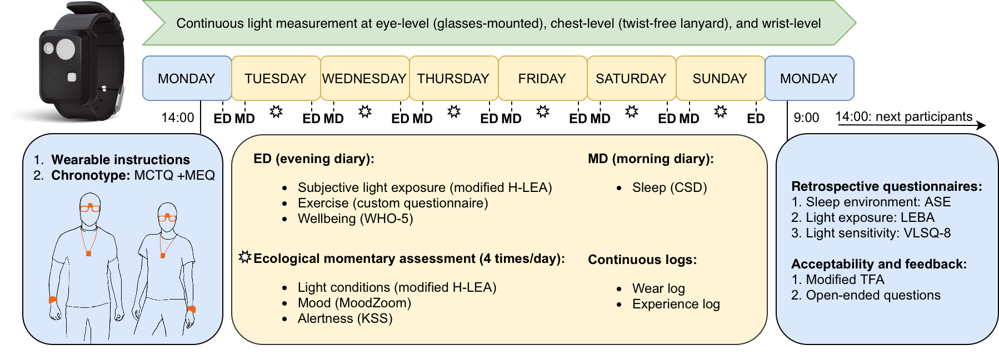
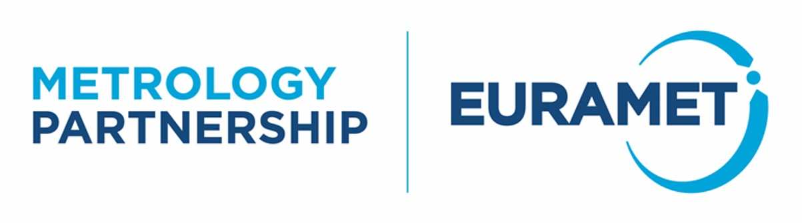
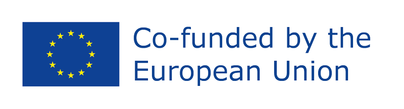

<!-- README.md is generated from README.Rmd. Please edit that file -->

```{r, include = FALSE}
knitr::opts_chunk$set(
  collapse = TRUE,
  comment = "#>",
  fig.path = "man/figures/README-",
  out.width = "100%"
)
```

# melidosData <a href="https://melidosproject.github.io/melidosData/"></a>

<!-- badges: start -->

[](https://github.com/MeLiDosProject/melidosData/actions/workflows/R-CMD-check.yaml)

<!-- badges: end -->

`melidosData` helps you **load data from the [MeLiDos field study](https://github.com/MeLiDosProject)**. It also contains helpers to **work with REDCap dictionaries and metadata**.

## The project

The [MeLiDos field study](https://github.com/MeLiDosProject) datasets contain wearable data for personal light exposure at the eye, chest, and wrist level for **191 participants across 9 sites and 7 countries, capturing 1480 participant days of annotated data**. Through a host of questionnaires at screening and discharge time, ecological momentary assessment, diaries, and logs, extensive auxiliary data are available.

-   Main workflow:
    -   `load_data()` downloads a modality for one or many sites.
    -   `flatten_data()` combines multi-site lists into one analysis-ready table, including a shared timezone.

{width="80%"}

| Institution (site Abbr.) | City | Country | Repository | DOI |
|----------|----------|-------------|--------------------------|---------------------|
| RISE | Borås | Sweden | [NilssonTengelinEtAl_Dataset_2026](https://github.com/MeLiDosProject/NilssonTengelinEtAl_Dataset_2026) | 10.5281/zenodo.18925834 |
| THUAS | Delft | The Netherlands | [AertsEtAl_Dataset_2025](https://github.com/MeLiDosProject/AertsEtAl_Dataset_2025) | 10.5281/zenodo.17979893 |
| BAUA | Dortmund | Germany | [BroszioEtAl_Dataset_2025](https://github.com/MeLiDosProject/BroszioEtAl_Dataset_2025) | 10.5281/zenodo.18111232 |
| MPI | Tübingen | Germany | [GuidolinEtAl_Dataset_2025](https://github.com/MeLiDosProject/GuidolinEtAl_Dataset_2025) | 10.5281/zenodo.16895188 |
| TUM | Munich | Germany | [HildenEtAl_Dataset_2025](https://github.com/MeLiDosProject/HildenEtAl_Dataset_2025) | 10.5281/zenodo.16893901 |
| FUSPCEU | Madrid | Spain | [BaezaEtAl_Dataset_2025](https://github.com/MeLiDosProject/BaezaEtAl_Dataset_2025) | 10.5281/zenodo.16834951 |
| IZTECH | Izmir | Turkey | [DidikogluEtAl_Dataset_2025](https://github.com/MeLiDosProject/DidikogluEtAl_Dataset_2025) | 10.5281/zenodo.16568109 |
| UCR | San José | Costa Rica | [Sancho-SalasEtAl_Dataset_2025](https://github.com/MeLiDosProject/Sancho-SalasEtAl_Dataset_2025) | 10.5281/zenodo.17289456 |
| KNUST | Kumasi | Ghana | [AkuffoEtAl_Dataset_2025](https://github.com/MeLiDosProject/AkuffoEtAl_Dataset_2025) | 10.5281/zenodo.15576731 |

: Overview of the available sites in the package



## Installation

You can install the CRAN version of melidosData with:

``` r
install.packages("melidosData")
```

You can install the development version of melidosData from GitHub with:

``` r
# install.packages("pak")
pak::pak("MeLiDosProject/melidosData")
```

## Main workflow example

```{r main-workflow, warning =FALSE, message = FALSE}
library(melidosData)
library(LightLogR) #for visualization
library(dplyr) #for data manipulation

# one site -> data frame
sleep_tum <- load_data("sleepdiaries", site = "TUM")
sleep_tum |> select(Id, sleep, wake) |> head()

# many sites -> `melidos_data` list
sleep_all <- load_data("sleepdiaries", site = c("TUM", "UCR"))
sleep_all |> summary()

# flatten list output for analysis
sleep_all_flat <- flatten_data(sleep_all, tz = "UTC")
sleep_all_flat |> 
  select(site, Id, sleep, wake) |> 
  group_by(site) |> 
  slice_head(n=3)
```

## Modalities

The following list of modalities contains the modality codes to be used in `load_data()`.

### Light exposure:

-   *light_glasses*, *light_chest*, *light_wrist*: personal light exposure datasets, captured with `ActLumus` devices, recorded in 10 second intervals for the eye-level, chest-level, and wrist-level position. Data are minimally checked after import (range, explicit gaps, device malfunctions, time shifts).

-   *light_glasses_1minute*, *light_chest_1minute*, *light_wrist_1minute*: as above, but aggregated to 1-minute intervals. Furthermore, days with less than 80% of data coverage are removed. This makes the datasets both faster to download, computationally easier to work with, and also more stable to calculate light exposure metrics

### Questionnaires (screening and discharge):

-   *health*: Lifestyle and health
-   *demographics*: Demographics
-   *chronotype*: Chronotype (MCTQ, MEQ)
-   *accectability*: Light glasses acceptability
-   *ase*: Sleep environment (ASE)
-   *evaluation*: Evaluation of study by participants
-   *leba*: Light exposure behavior (LEBA)
-   *vlsq8*: Light sensitivity (VLSQ-8)

### Diaries (morning or evening):

-   *sleepdiaries*: Sleepdiary
-   *lightexposurediary*: Light exposure diary (mH-LEA) and activity diary
-   *exercisediary*: Exercise diary
-   *wellbeingdiary*: Wellbeing diary (WHO-5)

### Logs (when required):

-   *wearlog*: Wear/Non-wear log
-   *experiencelog*: Experience log

### Ecological momentary assessment (4 times per day):

-   *currentconditions*: Current light, mood, and alertness

## Sites

The nine sites are centered on universities and research institutes. The packages contains relevant metadata for these sites:

```{r}
melidos_countries
melidos_cities
melidos_colors
melidos_coordinates
melidos_tzs
```

More information is found under the full repository of each dataset on the [project page](https://github.com/MeLiDosProject).

## Mini vignette: REDCap helper workflow

```{r redecap-vignette}
# 1) load dictionary and clean labels
codebook_path <- system.file("ext", "DataDictionary_sleepdiary.csv", package = "melidosData")
codebook <- utils::read.csv(codebook_path, check.names = FALSE)
codebook_clean <- REDCap_codebook_prepare(codebook)
codebook_clean |> names()

# 2) start with example REDCap export
sleep <- REDCap_example_sleep
sleep$sleepquality #original

# 3) check expected column types against dictionary metadata
check <- REDCap_coltype_check(codebook_clean, data = sleep)
check$ok
check$details

# 4) convert factor numbers into factors
sleep_factors <- REDCap_factors(sleep, codebook_clean)
sleep_factors$sleepquality #factors

# 5) attach human-readable labels from dictionary
sleep_labelled <- REDCap_col_labels(sleep_factors, codebook_clean)
sleep_labelled$sleepquality #factors with label

#6) add arbitrary labels, e.g. for computed variables
sleep_labelled <- sleep_labelled |> mutate(actual_sleep = sleep + sleepdelay*60)
sleep_labelled$actual_sleep |> attr("label") # incorrect label (taken from sleep)

sleep_labelled <- sleep_labelled |> add_labels(c(actual_sleep = "Time of sleep including sleepdelay (calculated)"))
sleep_labelled$actual_sleep |> attr("label") #new label
```

> Note: labels are volatile in R. If they are lost, e.g. after data transformation, the functions can be reexecuted.

## About the MeLiDos project

[*MeLiDos*](https://www.melidos.eu) is a joint, [EURAMET](https://www.euramet.org)-funded project involving sixteen partners across Europe, aimed at developing a metrology and a standard workflow for wearable light logger data and optical radiation dosimeters. Its primary contributions towards fostering FAIR data include the development of a common file format, robust metadata descriptors, and an accompanying open-source software ecosystem.

[{width="282"}](https://www.euramet.org) {width="288"}

The project (22NRM05 MeLiDos) has received funding from the European Partnership on Metrology, co-financed from the European Union's Horizon Europe Research and Innovation Programme and by the Participating States. Views and opinions expressed are however those of the author(s) only and do not necessarily reflect those of the European Union or EURAMET. Neither the European Union nor the granting authority can be held responsible for them.
